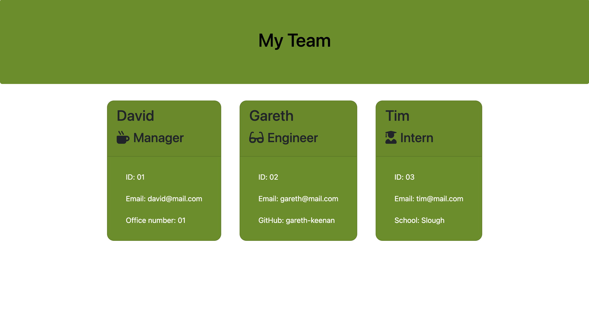

# Team-Profile-Generator

## Description

This program allows the user to generate a html page for their team members, distinguishing between managers, engineers and interns. Users run the program in the terminal and enter the relevant information by following the prompts on screen. Once all information is entered, a html page is generated.

## Installation

The following packages will need to be installed:

~~~ javascript
    npm i inquirer
~~~

~~~ javascript
    npm i fs
~~~

~~~ javascript
    npm i jest
~~~

## Instructions

To run the program, use the following code in the terminal, then follow the prompts:
~~~ javascript
    npm run test
~~~

The HTML will be in the output folder

## Testing
To test the program, run 
~~~ javascript
    npm run test
~~~

[GitHub Repo](https://github.com/tobias-firth/Team-Profile-Generator)

[GitHub Profile](https://github.com/tobias-firth/)
